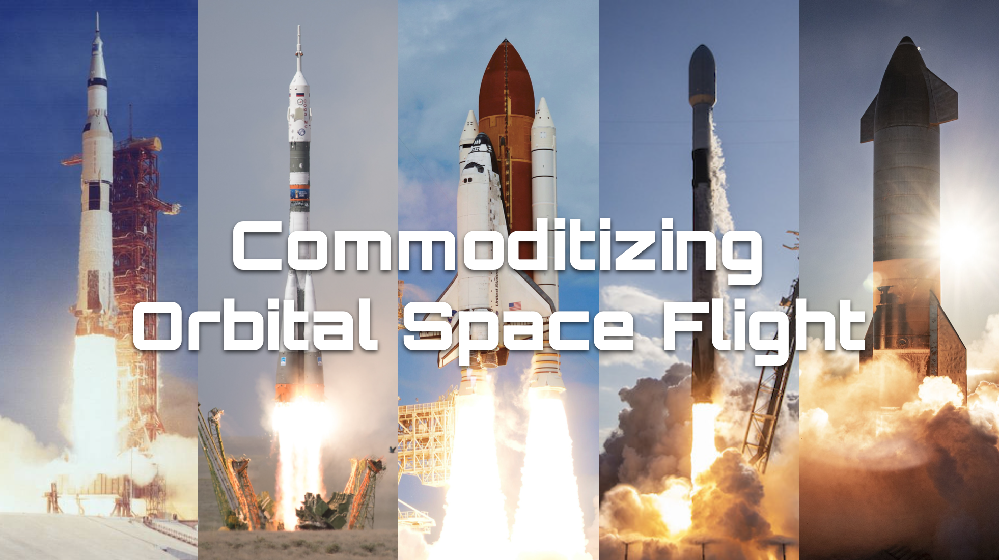

# Analyis of the Orital Launch Market
After the first Moon landing in 1969, people surely must have thought that humanity would be faring between the stars in 2021. Reality started to hit only three years later with the last Moon landing to date in 1972. 

Through our experience with computers and smartphones, it is a commonly held notion that technological progress moves at an exponential pace. But technological progress is not a guarantee.

High launch costs rendered broad access to orbit and beyond an impossibilty. 

More and more aerospace companies are joining the revolution of reusable launch vehicles to drive costs down, broadening commercial and civilian access to space.

This analysis tries to understand which of these reusable launch vehicles has the highest chance at success in this technically challenging and competitive industry. The focus here is on understanding payload mass demand based on historical data.

The link to the Google Slides presentation can be found [here](https://docs.google.com/presentation/d/17ntB3DWAQ2phthTD7lwG6r-HAn0Chs6MlOeARfAtu4c/edit?usp=sharing).
