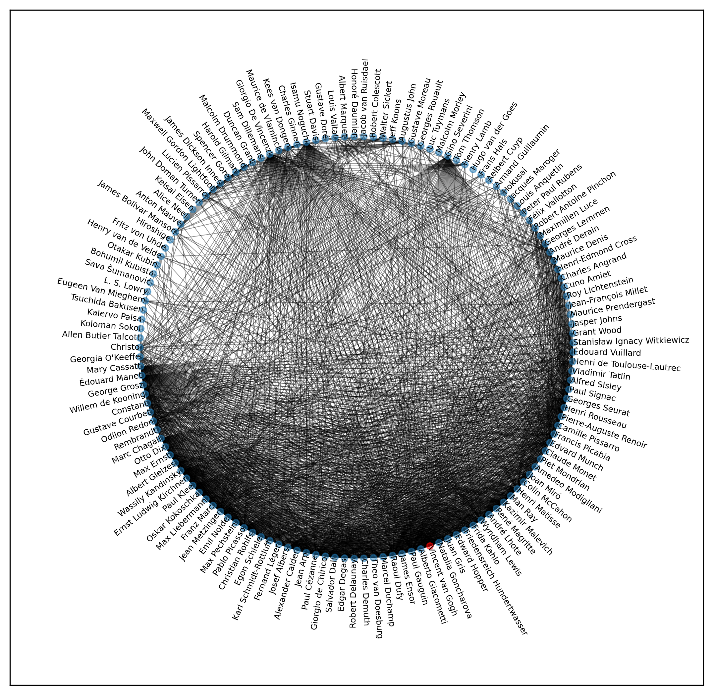

# Network Graph Analysis of Painters in the English Wikipedia

For this project I scrapped the English Wikipedia for the pages of painters listed [here](https://en.wikipedia.org/wiki/List_of_painters_by_name) (~ 3400 names) and searched those pages for mentions of these painters. From this I generated a network graph showing their connectivity. This should capture who an artist was inspired by and who they inspired.

For example, here we can see the network of Vincent van Goghs (red node) connections (yellow nodes) in the context of all other painters.

Here is a more detailed view showing a circular graph of Vincent van Goghs (red node) network.

This project is work in progress and things I want to incorporate are an interactive and searchable graph.
